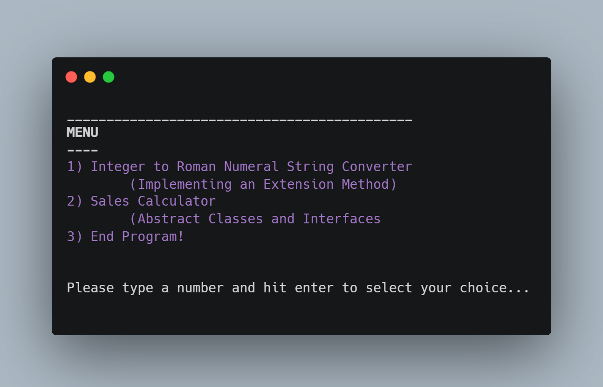
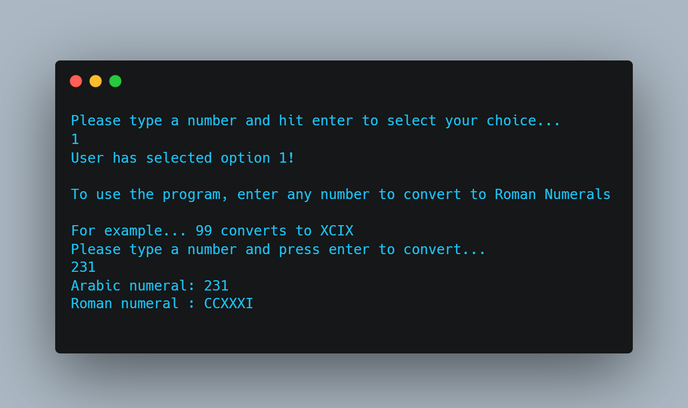
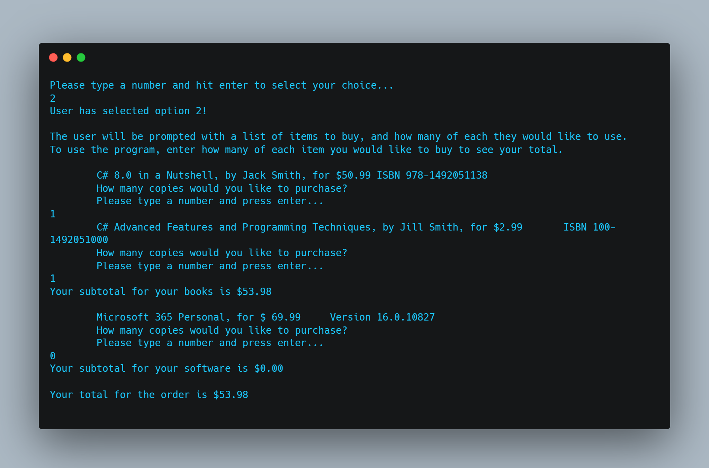

# Sales Calculator and Roman Numeral Converter 

(FSC-BCS-426-Lab3)

## Output Menu

## Assignment Context

This project was one of the first assignments for my C# programming class.

The goal of this assignment was for students to get comfortable with C#, so we were prompted to further explore different class types and behavior.

We were expected to be able to use abstract and static classes, interfaces, and inheritance to write a sales calculator and convert numbers to Roman numerals.

This was a solo assignment made with C# and ASP.NET using Visual Studio 2022.

## Features

- Calculates the total sales amount.
- Converts positive integer numbers to Roman numerals.

## How It Works

### Sales Calculator

The sales calculator is implemented using an abstract class `Product` and an interface `ISellable`. 
The `Product` class represents a product with a price, code, and description. 
The `Book` class and `Software` class inherit from the `Product` class and implement the `ISellable` interface. 
The `Book` class represents a book with an author, and the `Software` class represents software with a version.

The sales calculation is done in the `sell()` method of the `Book` and `Software` classes. 
The `Main()` method of the `Program` class prompts the user to input the number of each item they would like to buy and calculates the total sales amount based on the prices and quantities.

#### Output

### Roman Numeral Converter

The Roman numeral converter is implemented using an extension method `toRoman()` for the `int` data type. 
The method takes an integer as input and returns its Roman numeral representation as a string.

The `Main()` method of the `Program` class prompts the user to input a number to convert to Roman numerals and calls the `toRoman()` method to perform the conversion.

#### Output

